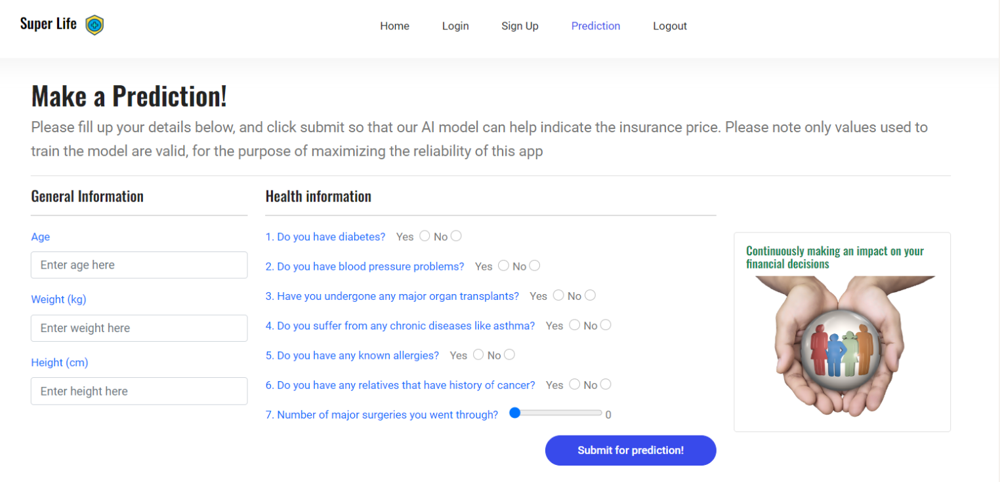

<h1 align="center">Super Life</h1>

<b>Insuring Your Health</b>

## Overview

**Super Life** specializes in predicting insurance premium costs based on an individual's general health profile. By leveraging machine learning algorithms, Super Life evaluates key factors such as medical history, lifestyle habits, and current health metrics to provide highly accurate and personalized insurance premium estimates. Super Life empowers users with transparent, data-driven insights, enabling them to make informed decisions and plan for a secure future.

### Demo

## Built with:

- Flask Suite (Web framework for Python, using Jinja2 templating)
- SQLAlchemy (a Object-Relational Mapping library)
- Pytest (Unit testing)
- sklearn (ML implementation)

